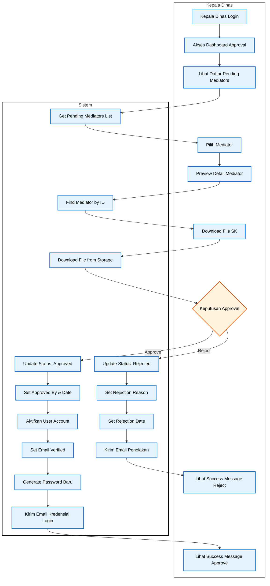
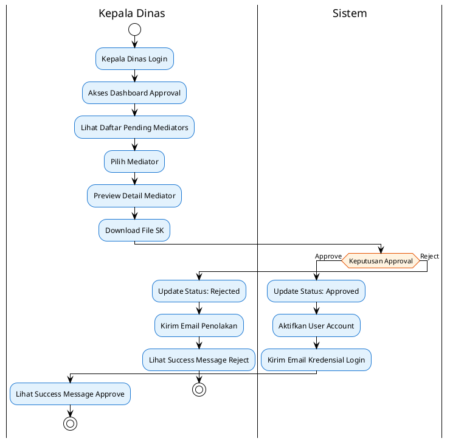

# Activity Diagram - Use Case 2: Kepala Dinas Approval

## Activity Diagram untuk Kepala Dinas Approval

**Use Case:** Kepala dinas menyetujui akun mediator
**Aktor:** Kepala Dinas

## Konversi ke PlantUML (Format Sederhana)

