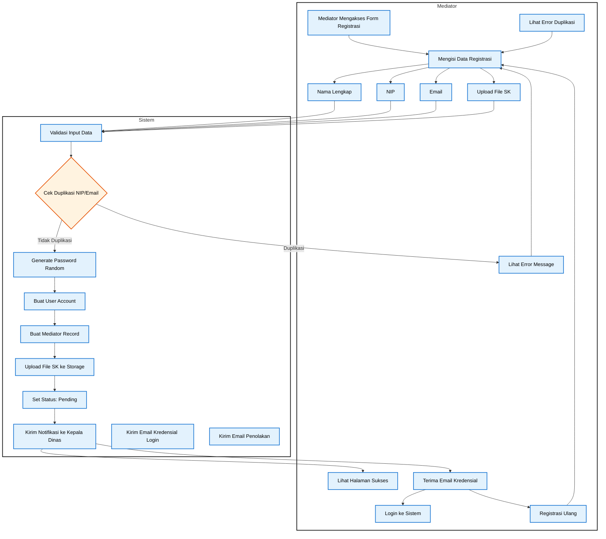
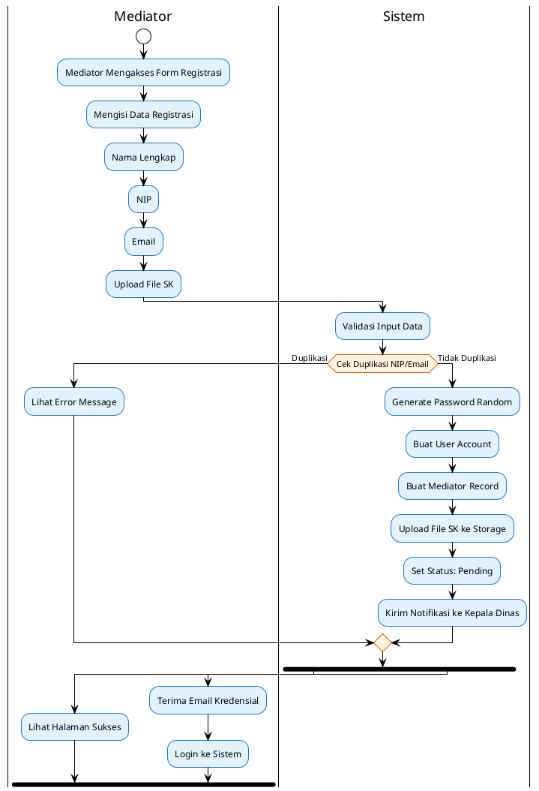

# Activity Diagram - Use Case 1: Registrasi Mediator

## Activity Diagram untuk Mediator Registration

**Use Case:** Mediator mendaftarkan akun di sistem
**Aktor:** Mediator

## Konversi ke PlantUML

