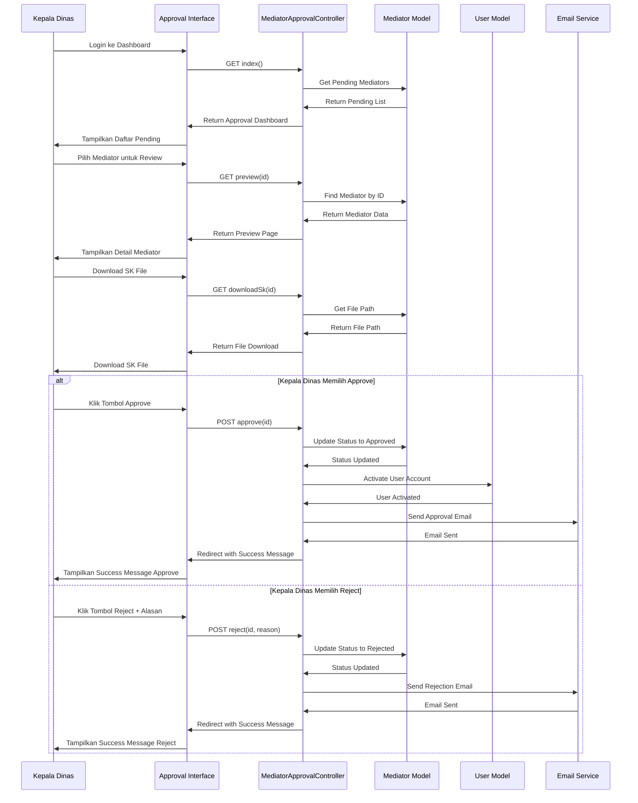
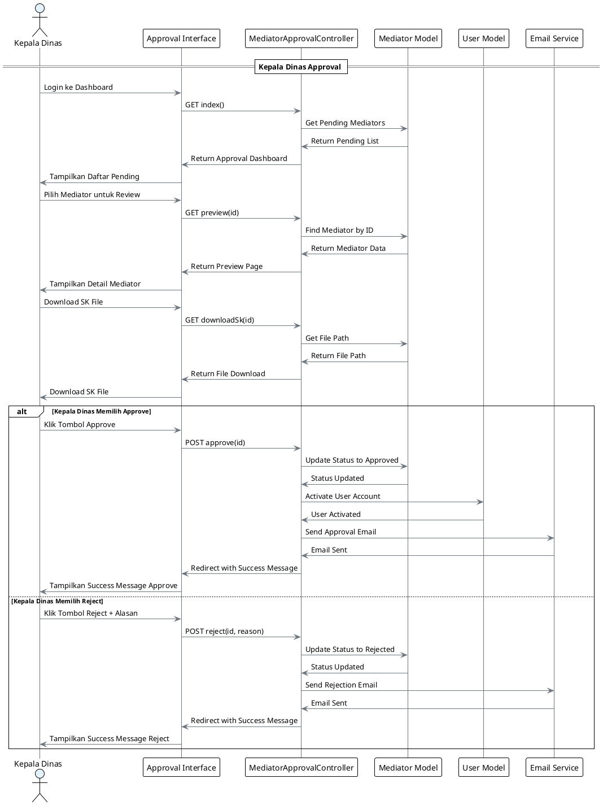

# Sequence Diagram - Use Case 2: Kepala Dinas Approval

## Sequence Diagram untuk Kepala Dinas Approval (Simple)

**Use Case:** Kepala dinas menyetujui akun mediator
**Aktor:** Kepala Dinas

## Konversi ke PlantUML (Simple)

