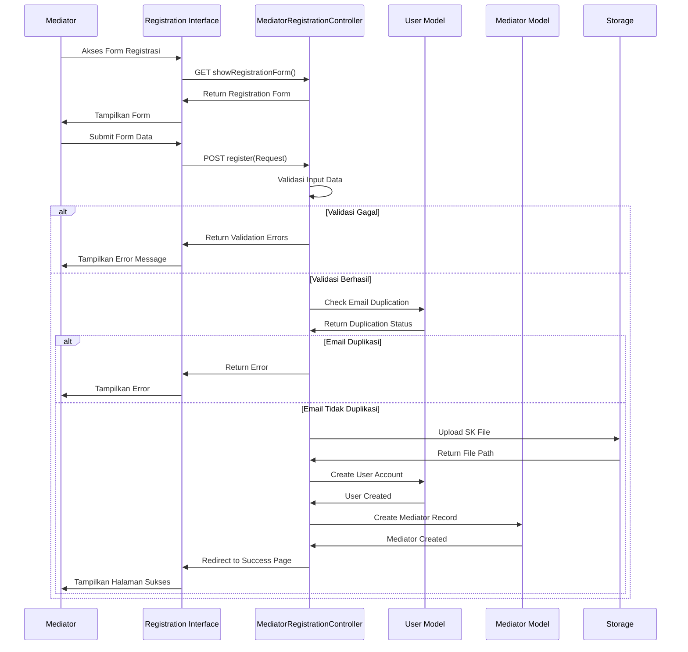
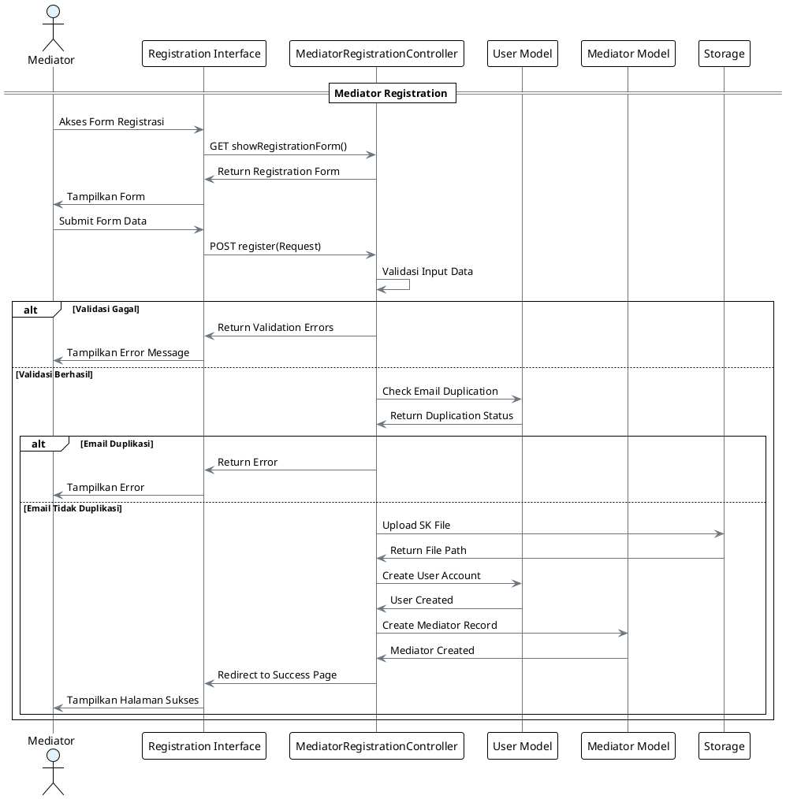

# Sequence Diagram - Use Case 1: Registrasi Mediator

## Sequence Diagram untuk Mediator Registration (Simple)

**Use Case:** Mediator mendaftarkan akun di sistem
**Aktor:** Mediator

## Konversi ke PlantUML (Simple)

